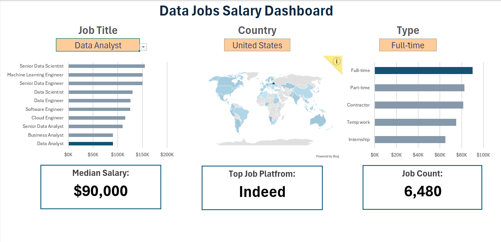

# Excel Data Jobs Salary Dashboard
## Overview
The Data Jobs Salary Dashboard is an interactive Excel dashboard that visualizes salary trends for various data-related job roles across countries, job types, and platforms. It provides an intuitive overview of the job market insights for roles such as Data Analyst, Data Scientist, Data Engineer, Business Analyst, etc.
#### Dashboard File
My final dashboard is in [Data Jobs Salary Dashboard.xlsx](Data Jobs Salary Dashboard.xlsx)
## Objective
To explore and visualize the global data job market, focusing on:
- Salary distribution across different roles, countries, and employment types.
- Identifying median salaries, top job platforms, and job availability
## Excel Skills Used
- __Pivot Tables —__ Aggregating and summarizing data for key metrics
- __Charts & Maps —__ Visualizing salaries by job type and country
- __Slicers & Dropdowns —__ Enabling interactive filtering by job title, country, and job type
## Dashboard Preview
